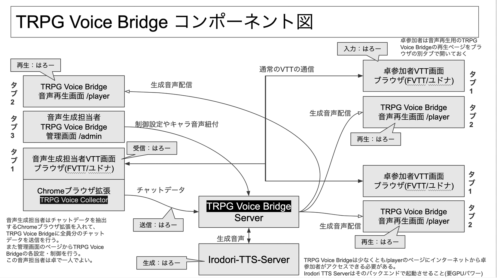

# TRPG Voice Bridge

FVTTやユドナリウムなどのVTTから音声担当者（GMまたはPL）のブラウザ拡張で公開発言を取り込み、Irodoriで一度だけ生成して、参加者のブラウザへ同じ音声を配るためのシステムです。



**現時点では共通基盤とFVTT取得の実装段階です。FVTTやユドナリウム、ココフォリアなどのVTTすべてに対応した完成版ではありません。** FVTT 12/13はフックのfixture試験まで、通常版ユドナリウムは取得条件を満たす環境に限る実験実装、ココフォリアは安全な取得方法の検証待ちで実装を中断しています。

- [接続図・Collectorの説明・セットアップ](docs/setup-guide.md)
- [起動・設定の詳細](tts-bridge/README.md)
- [HTTPS公開設定例](docs/online.md)

```sh
cd tts-bridge
npm ci
npm start
```

管理画面は http://127.0.0.1:8090/admin/ 。Irodoriは http://127.0.0.1:8088 を既定にし、接続先は管理画面で変更できます。
