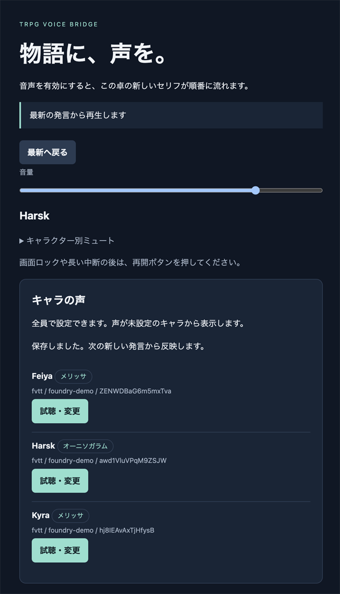
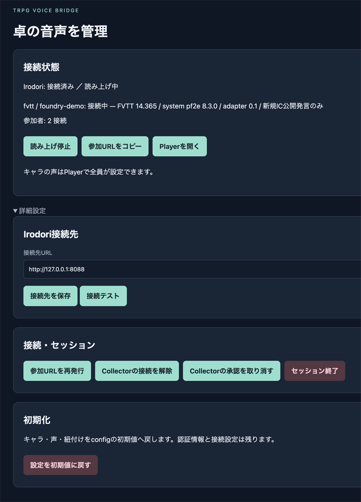
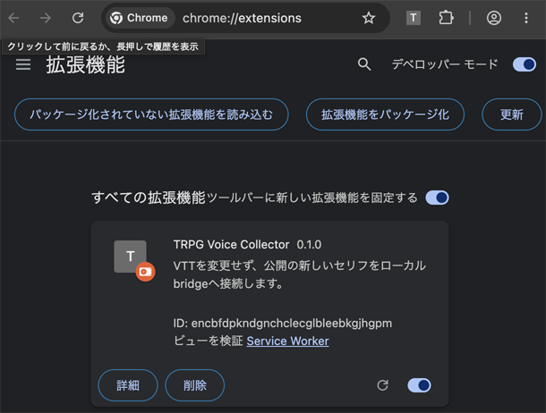
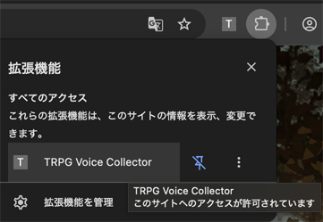

# TRPG Voice Bridge

FVTTやユドナリウムなどのVTTから音声担当者（GMまたはPL）のブラウザ拡張で公開発言を取り込み、Irodori-TTS-Server で発言テキストの音声生成を動的に行って、参加者のブラウザへ同じ音声を配るためのシステムです。


キャラの声はPlayerで全員が設定できます。Collectorの初回承認と読み上げ開始・停止は管理画面で行います。

- [Quick Start](quickstart.md)
- 詳細情報
  - [接続図・Collectorの説明・セットアップ](docs/setup-guide.md)
  - [起動・設定の詳細](tts-bridge/README.md)
  - [HTTPS公開設定例](docs/online.md)

## Irodori-TTS-Server について

音声の生成には[Irodori-TTS-Server](https://github.com/Aratako/Irodori-TTS-Server)を使います。日本語音声合成モデル[Irodori-TTS](https://github.com/Aratako/Irodori-TTS)を、OpenAIのText-to-Speech API互換で提供するサーバーです。Bridgeと同じマシンで`127.0.0.1:8088`に起動する構成を標準にしています（[Quick Start](quickstart.md)）。

Bridgeが使うIrodoriの機能は次のとおりです。

- **声の説明文による声づくり（Voice Design）**: 「落ち着いた年配の男性の声」のような説明文（caption）とseedで声を作ります。参照音声がなくても、キャラごとに声を作り分けられます。
- **参照音声による声の固定**: 参照音声を指定すると、その声質に寄せて生成します。Playerで試聴した声を、そのまま参照音声として登録できます。
- **発言ごとの演技指示**: 発言に書いた感情や演技の指示を反映して生成します（[書き方](#演技指示の書き方)）。

### 推奨モデル

| モデル | ライセンス | 特徴 |
| :--- | :--- | :--- |
| [Aratako/Irodori-TTS-v4.1-Small](https://huggingface.co/Aratako/Irodori-TTS-v4.1-Small) | MIT | 標準的な小型モデル。生成が速く、手元のGPUやApple Siliconでも扱いやすいです。 |
| [phasefield-audio/Irodori-TTS-v4.1-Anime](https://huggingface.co/phasefield-audio/Irodori-TTS-v4.1-Anime) | MIT | v4.1-Smallをアニメ調の音声で追加学習したモデル。キャラクターらしい演技に向きます。説明文や絵文字の効き方はベースモデルと異なる場合があります。 |
| [Aratako/Irodori-TTS-v4-Large](https://huggingface.co/Aratako/Irodori-TTS-v4-Large) | Gemma | 約3.29Bパラメーターの大型モデル。説明文への追従性が高い一方、多くのメモリと生成時間が必要です。 |

ライセンスはモデルごとに異なります。v4-LargeはGemmaの利用規約に従います。

量子化版もあります。v4.1-Animeはリポジトリ内のサブフォルダーに、v4-Largeは[Aratako/Irodori-TTS-v4-Large-Quantized](https://huggingface.co/Aratako/Irodori-TTS-v4-Large-Quantized)に収録されています。量子化版はおもにNVIDIA CUDA向けです。

Apple Siliconで動かす場合は、MLXハイブリッド推論を追加したフォーク[okamichi/Irodori-TTS-Server](https://github.com/okamichi/Irodori-TTS-Server)の`mlx`ブランチを用意しています。

## 演技指示の書き方

VTTのチャットで、発言の中に絵文字か全角の丸カッコで指示を書きます。丸カッコの指示は読み上げから取り除かれます。

```text
（怒り）ふざけるな！（間）……もういい。
😲えっ、本当に？
（演技:震える声で、怯えながら）誰か……いるの？
```

- **感情・演技の切り替え**: 絵文字を直接書くか、`（単語）`と書きます。書いた位置から演技を切り替えます。使える単語と絵文字は次のとおりです。
  喜び😆 怒り😠 悲しみ😭 驚き😲 心配😟 緊張😰 安堵😌 自信😎 照れ🫣 囁き・ささやき・小声👂 優しく🫶 笑い🤭 ため息😮‍💨 早口⏩ ゆっくり🐢 叫び😱 眠そう😪 懇願🙏 ナレーション📖 間⏸️（`通常`は指示なし）
- **自由な文章**: `（演技:説明）`または`（感情:説明）`と書くと、その発言のあいだだけ、キャラの声の説明文（caption）の後ろに追記して生成します。発言全体にかかります。
- 上の単語でも`演技:`・`感情:`付きでもない丸カッコ（例：`（小さく笑う）`、`剣（つるぎ）`）は、本文として読み上げます。
- 指示は1つ100文字まで、自由な文章の合計は200文字までです。

効き方はモデルによって異なり、対応していないモデルもあります。絵文字の対応表は、Irodori-TTS-v4.1-Smallとv4-Largeの公式の表に合わせています。v4.1-Animeは独自の学習データで追加学習されているため、絵文字や説明文が表のとおりに効くとは限りません。上の表にない絵文字もそのままモデルに渡りますが、効くとは限りません。Playerの「試聴するセリフ」欄にも同じ書き方が使えるので、試聴して確かめてください。指示はVTTのチャット欄にはそのまま表示されます。

効きが悪いときは、Playerの声の設定画面にある「声の詳細設定」を調整して、試聴しながら確かめてください。CFGは上げすぎると音声が不自然になるため、少しずつ変えます。

- **説明CFG**（Irodoriの既定値3.0）: 上げると、声の説明文と`（演技:…）`の指示が効きやすくなります。
- **生成ステップ数**: 増やすと、生成は遅くなりますが安定しやすくなります。
- **seed**: 変えると、同じ設定でも別の生成結果になります。

## スクリーンショット

### /player 卓音声再生・キャラ声紐付けページ

参加者が音声を聞き、キャラの声を設定する画面です。



### /admin 管理ページ

接続状態の確認、読み上げの開始・停止、参加URLの発行などを行います。



### ブラウザ拡張（Collector）

音声担当者のChromeに読み込んだCollector拡張と、VTTのサイトへのアクセスが許可されている状態です。





## 利用上の注意

- 実在の人物（声優・著名人など）の声や、版権作品のキャラクターの声を、本人や権利者の許可なく参照音声として登録・使用しないでください。
- そのような声で生成した音声や、それを含む録画・配信などを公開しないでください。
- 使用するモデルのライセンスと利用制限に従ってください（各モデルカードの記載、v4-LargeはGemmaの利用規約）。
- 本ソフトウェアの利用によって生じたいかなる損害についても、作者は責任を負いません（[LICENSE](LICENSE)も参照）。

## ライセンス

MITライセンスです。全文は[LICENSE](LICENSE)を参照してください。
