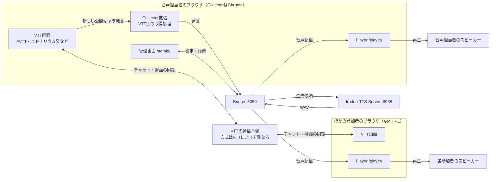

# セットアップガイド

この文書は、誰がどの画面を開き、何がどこへ接続するかを説明します。FVTTではキャラ発言から音声再生まで確認済みです。通常ユドナリウムとココフォリアは、実際の卓を使った取得確認が終わっていません。

## 接続の全体像

FVTT・ユドナリウム系などのVTTで共通して使う構成です。Collector内の取得処理を対象VTTに合わせ、Bridge以降の音声生成・配信を共通化します。各VTTの実装・検証状況は下の対応表を参照してください。

ここでいう「音声担当者」は、CollectorとBridgeを動かし、声の設定を管理する人です。GMでもPLの一人でも担当でき、VTTのGM権限は必要ありません。対象の公開チャットを受信できる人を、同じ入力元につき一人決めます。

URLはBridgeとIrodoriを音声担当者のPCで動かす場合の例です。`127.0.0.1`は、そのURLを開いている端末自身を指します。

| 部品 | 動かす場所・入口 | 役割 |
| --- | --- | --- |
| VTT（FVTT・ユドナリウム系など） | 卓参加者（GM・PL）のブラウザで、それぞれのVTTのURLを開く | チャットと盤面を表示する |
| VTTの通信基盤 | VTTごとのサーバーや接続サービス | チャットと盤面を参加者間で同期する。方式は下表を参照 |
| Collector | 音声担当者のChrome拡張 | 音声担当者が開いたVTTの新しい公開キャラ発言をBridgeへ送る |
| Bridge | 音声担当者のPCの`127.0.0.1:8090` | 発言を受け、キャラと声を選び、音声を参加者へ配信する |
| 管理画面 | 音声担当者のブラウザでBridgeの`/admin/` | 声・キャラ・話者の紐付けと接続状態を管理する |
| Irodori-TTS-Server | 音声担当者のPCの`127.0.0.1:8088` | Bridgeから受けたセリフのWAV音声を生成する |
| Player | 卓参加者全員（GM・PL）のブラウザでBridgeの`/player/` | 配信された音声を各端末のスピーカーで再生する |

### ASCII図

```text
卓のチャット・盤面（VTTごとの方式で同期）:

  [音声担当者のブラウザ: VTT] <---- VTTの通信基盤 ----> [ほかの参加者のブラウザ: VTT]

セリフの読み上げ:

  [音声担当者のChrome: VTT]
           | 新しい公開キャラ発言
           v
  [Collector: VTT別の取得処理] --発言--> [Bridge :8090]
                                            |       ^
                                    生成依頼|       |WAV
                                            v       |
                                       [Irodori :8088]

  [音声担当者のブラウザ: 管理画面] <--設定・診断--> [Bridge :8090]
  [Bridge :8090] --音声--> [音声担当者のブラウザ: Player] --> スピーカー
                  +--音声--> [ほかの参加者のブラウザ: Player] --> 各自のスピーカー
```

### Mermaid図



管理画面とPlayerは、どちらもBridgeが提供するWebページです。追加のサーバープロセスを起動する必要はありません。

VTTの通信基盤の違いは次の通りです。上の図は論理的な接続を示し、実際の同期経路はVTTによって異なります。

| VTT | チャット・盤面の通信方式 |
| --- | --- |
| FVTT | 卓参加者（GM・PL）のブラウザがFVTTサーバーへ接続する |
| ユドナリウム系 | ブラウザ間のP2P通信が中心。SkyWayなどの接続サービスを使い、版や派生に応じて認証用バックエンドも必要になる |

SkyWayバックエンドはユドナリウム系の接続用で、音声生成・配信の共通構成には含まれません。

音声担当者のCollectorがVTT画面から発言を取得してBridgeへ送ります。参加者はVTTとPlayerの両方を開き、Collectorは音声担当者だけが使います。音声担当者もPlayerを開いて聞きます。上記の`127.0.0.1:8090`は音声担当者のPCからしか開けません。別の家の参加者へ音声を届ける場合は、VTT側のオンライン接続に加えて[PlayerのHTTPS公開](online.md)が必要です。

## Collectorとは

Collectorは、このリポジトリの[`tts-bridge/collector/`](../tts-bridge/collector/manifest.json)にある**音声担当者用Chrome/Chromium拡張機能**です。別途作成する必要はありません。VTT本体、ワールド、ゲームシステム、FVTTモジュールやVTTサーバーの設定を変更せず、音声担当者が選んだタブで動きます。

音声担当者が拡張のポップアップでVTTの種類、入力元ID、部屋・ワールドID、bridgeの接続先を指定します。拡張は表示済みの履歴を読み上げず、公開と判定できた新しいキャラのセリフだけを送ります。送信には`collector`トークンを使い、VTTページ側にはそのトークンを渡しません。声の生成や参加者への配信はbridgeが担当します。

対応状況は次の通りです。

| VTT | 現在の状態 |
| --- | --- |
| FVTT 12/13/14 | 新規公開IC発言を取得。14.365 / PF2e 8.3.0 の実FVTTでキャラ発言からPlayerの音声再生まで確認済み。他の版・ゲームシステムは未確認 |
| 通常版ユドナリウム | 元発言IDと公開範囲を安全に取得できる場合だけ動く実験実装。一般的な本番ビルドでは停止する可能性がある |
| ローカルAxe改・開発ビルド | `localhost:4200`の1ブラウザで、公開タブのキャラ発言だけを検出する試験に成功。公開ビルドと複数参加者は未検証 |
| ココフォリア | 公開範囲と新着の実機検証待ち。現在は取得を停止する |

取得できないときはポップアップに診断理由を表示します。実機確認前に、三つのVTTに対応済みとして運用しないでください。

## まず1台のPCで動作を確かめる

この手順では音声担当者のPCでbridgeとIrodoriが動きます。VTT自体はインターネット上の別のサーバーでも構いません。

1. Irodori-TTS-Serverを起動し、`http://127.0.0.1:8088/health`が応答することを確認します。
2. `tts-bridge/`で`npm ci`、続いて`npm start`を実行します。Node.js 22.13以上が必要です。
3. 音声担当者が`http://127.0.0.1:8090/admin/`を開きます。初回起動時にできる`tts-bridge/data/credentials.json`の`admin`を入力します。
4. 管理画面でIrodoriの接続を確認し、声を試聴します。対象VTTの入力元を登録します。FVTTの部屋IDには`game.world.id`を指定します。わからない場合はFVTTを開いたブラウザの開発者コンソールで`game.world.id`を実行します。デモワールドは`foundry-demo`で、URL中の`demo`とは異なります。
5. Chrome/Chromiumの拡張機能画面でデベロッパーモードを有効にし、「パッケージ化されていない拡張機能を読み込む」から`tts-bridge/collector/`を選びます。
6. 音声担当者がVTTのタブで拡張を開きます。接続先を`http://127.0.0.1:8090`、トークンを`credentials.json`の`collector`にし、管理画面で登録した入力元IDと部屋IDを入力して「このタブを接続」を押します。FVTTの対象チャットは`main`、ローカルAxe改のメインタブは`MainTab`です。Axeではタブを表示した状態で接続してください。
7. 管理画面で「読み上げ開始」を押します。最初に観測した未登録の話者は読まれません。「未登録の発言者」は管理画面を表示中、5秒ごとに更新されます。声と紐付けると、次の発言から読まれます。
8. 管理画面で「参加URLを発行」し、音声担当者自身がPlayerで「音声を有効にする」を押して確認します。このローカルURLは他の家からは開けません。

FVTTではチャットを「Public as Character」にして、新しい発言を送ってください。「Public as User」やダイスロールは読み上げません。最初のキャラ発言が管理画面の「未登録の発言者」に現れたら、キャラと声を登録し、もう一度新しい発言を送ります。拡張のコードを更新した場合は`chrome://extensions/`でTRPG Voice Collectorを再読み込みし、FVTTタブで「このタブを接続」を押し直してください。

参加者が別のネットワークにいる場合、PlayerをHTTPSで公開する準備が必要です。[オンライン公開の説明](online.md)を参照してください。

## VTTは自宅、bridgeは別宅に置く場合

その配置は構成上可能ですが、**現コードのCollectorは`127.0.0.1`への送信に限定**されています。別宅のbridgeへ直接接続する設定は、まだ使えません。セットアップ手順が完成したかのように、公開ポートへCollectorトークンを入力しないでください。

この配置を実装するときは、次の接続が必要です。

1. 音声担当者のブラウザ拡張から、別宅bridgeの認証付きHTTPS入力APIへ接続する。拡張の接続先制限と権限設定も変更する。
2. 参加者のPlayerから、別宅bridgeのHTTPS/WSS配信口へ接続する。
3. bridgeからIrodoriへ接続する。Irodoriを別宅bridgeと同じサーバーで動かすか、両者間の私設経路を用意する。
4. 音声担当者が別宅bridgeのローカル管理画面を使うための管理用経路を用意する。現状の管理画面はbridgeサーバーの`127.0.0.1`限定です。

既存の[公開設定例](Caddyfile.example)は**参加者向けPlayerだけ**を転送し、Collector入力APIを転送しません。この別宅配置の公開設定・認証・実機検証は残作業です。
